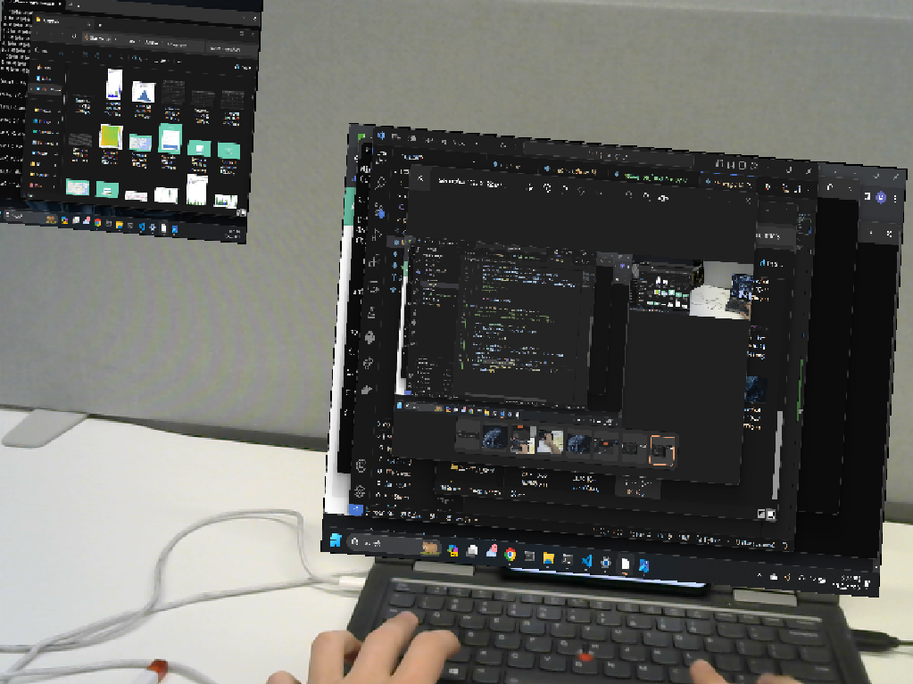

# Lightweight_XR
## Imagine the ability to use multiple monitors: anywhere, anytime

Design for a lightweight XR application utilizing openCV for productivity

Uses AruCo marker to project a virtual desktop and mediapipe for handtracking to resize monitors.

## Hand capture footage of monitor resizing

